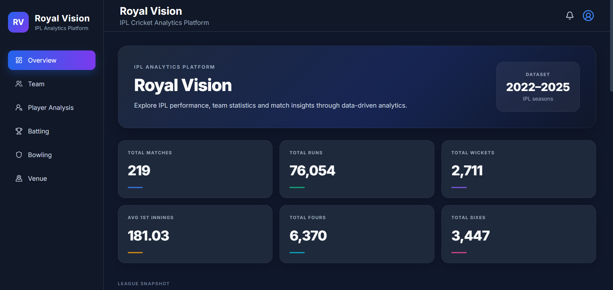
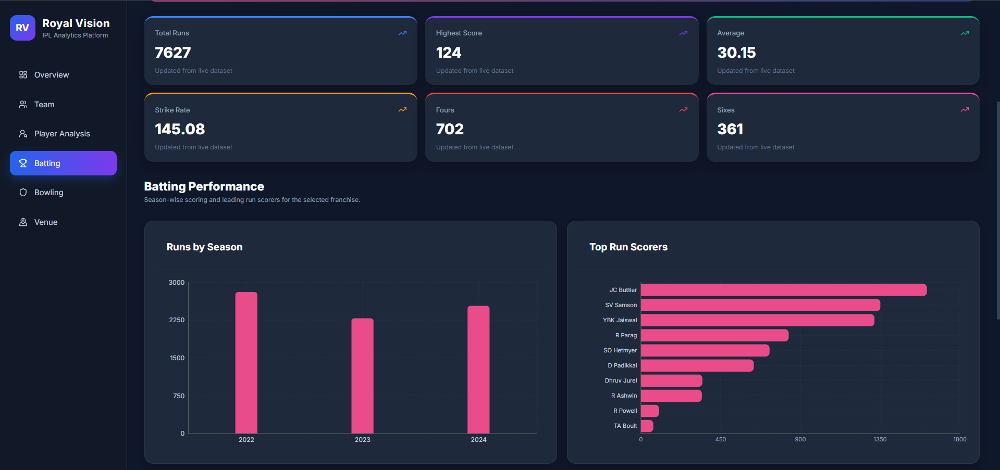
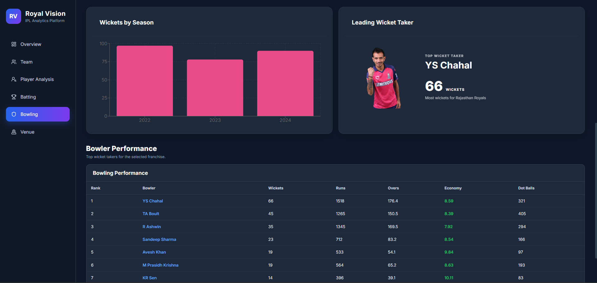
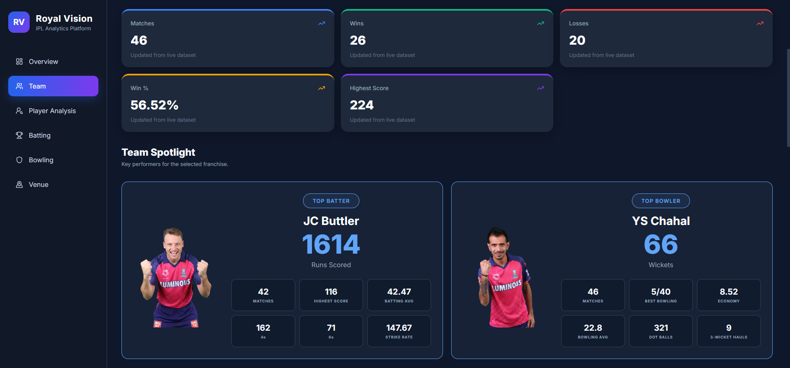
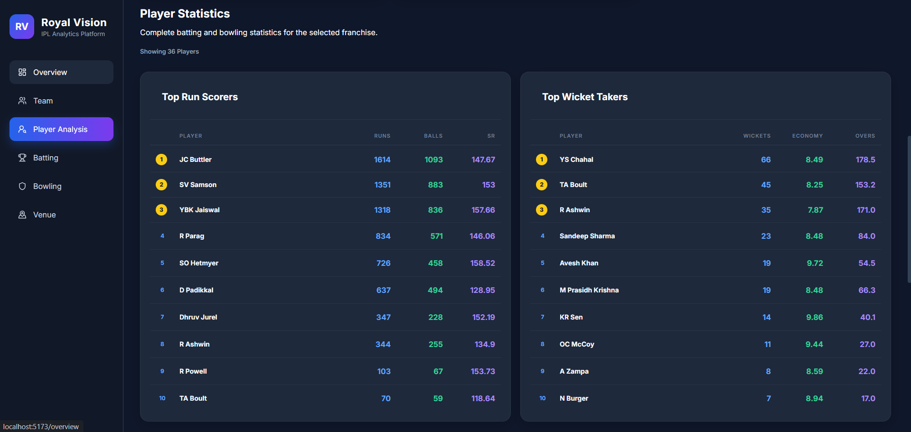
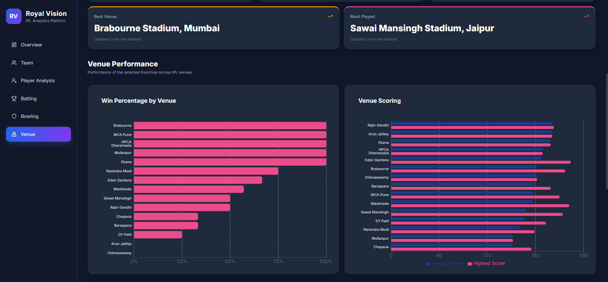

# 🏏 RoyalVision

Advanced Cricket Analytics & Decision Support Platform

RoyalVision is a full-stack cricket analytics platform designed to transform
IPL match data into meaningful performance insights through interactive
dashboards, statistical analysis, and team/player intelligence.

---

## 🎯 Project Objective

RoyalVision brings together data engineering, SQL analytics, backend APIs,
interactive React dashboards, and Power BI reporting into a single cricket
analytics platform.

The platform focuses on answering questions such as:

- How is a team performing across seasons?
- Which players are the strongest performers?
- How does batting and bowling performance change over time?
- Which venues favor a team?
- How does a team perform against different opponents?
- What are the team's scoring and bowling patterns?
- Which players have produced the most runs and wickets?

---

## 🚀 Key Features

### 📊 Overview Dashboard
- Overall IPL dataset KPIs
- Match and season summaries
- Team performance trends
- Top run scorers
- Top wicket takers
- Scoring profile
- Seasonal analysis

### 🏏 Batting Analytics
- Total runs
- Strike rate
- Boundary analysis
- Seasonal batting trends
- Top run scorers
- Player-level batting performance

### 🎯 Bowling Analytics
- Total wickets
- Economy rate
- Runs conceded
- Dot balls
- Wickets by season
- Top wicket takers
- Bowler performance table

### 🏆 Team Analytics
- Matches played
- Wins and losses
- Win percentage
- Highest score
- Season-wise performance
- Venue performance
- Toss analysis
- Match results

### 👤 Player Analytics
- Player performance
- Batting statistics
- Bowling statistics
- Player spotlight
- Player images and profiles

### 🏟️ Venue Analytics
- Venue-wise performance
- Matches played
- Wins and losses
- Team performance across venues

---

## 🧠 Analytics Architecture

```text
Raw IPL Dataset
      │
      ▼
Python / Pandas
      │
      ▼
Data Cleaning & Filtering
      │
      ▼
PostgreSQL
      │
      ├── Overview Analytics
      ├── Batting Analytics
      ├── Bowling Analytics
      ├── Team Analytics
      ├── Venue Analytics
      └── RR Analysis
      │
      ▼
Node.js + Express APIs
      │
      ▼
React Dashboard
      │
      ▼
Interactive Cricket Analytics

---

## 📸 Dashboard Preview

### Overview Dashboard



### Batting Analytics



### Bowling Analytics



### Team Analytics



### Player Analytics



### Venue Analytics



---


## 🏗️ System Architecture

RoyalVision follows a layered analytics architecture:

```text
                    ┌─────────────────────┐
                    │    IPL Match Data   │
                    │   CSV / Raw Dataset  │
                    └──────────┬──────────┘
                               │
                               ▼
                    ┌─────────────────────┐
                    │   Python / Pandas   │
                    │ Data Cleaning & ETL │
                    └──────────┬──────────┘
                               │
                               ▼
                    ┌─────────────────────┐
                    │     PostgreSQL      │
                    │   Analytics Layer   │
                    └──────────┬──────────┘
                               │
                 ┌─────────────┴─────────────┐
                 │                           │
                 ▼                           ▼
        ┌─────────────────┐        ┌─────────────────┐
        │ SQL Analytics   │        │ Node.js /       │
        │ Queries         │        │ Express APIs    │
        └─────────────────┘        └────────┬────────┘
                                            │
                                            ▼
                                  ┌─────────────────┐
                                  │ React Frontend  │
                                  │ Interactive     │
                                  │ Dashboard       │
                                  └─────────────────┘

                    ┌─────────────────────┐
                    │     Power BI        │
                    │ Business Reporting  │
                    └─────────────────────┘


## 📁 Project Structure

```text
RoyalVision/
│
├── backend/
│   └── src/
│       ├── config/
│       ├── constants/
│       ├── controllers/
│       ├── middleware/
│       ├── routes/
│       └── services/
│
├── frontend/
│   ├── public/
│   │   ├── players/
│   │   └── teams/
│   └── src/
│       ├── api/
│       ├── components/
│       ├── pages/
│       ├── charts/
│       ├── data/
│       ├── styles/
│       ├── theme/
│       └── utils/
│
├── database/
│   └── analytics/
│       ├── 01_overview.sql
│       ├── 02_batting.sql
│       ├── 03_bowling.sql
│       ├── 04_team.sql
│       ├── 05_venue.sql
│       └── 06_rr_analysis.sql
│
├── datasets/
│   └── raw/
│
├── scripts/
│   ├── check_schema.py
│   └── filter_dataset.py
│
├── powerbi/
│   └── RoyalVision.pbix
│
├── docs/
│   └── screenshots/
│
├── docker-compose.yml
└── README.md


---

## ⚙️ Installation & Setup

### 1. Clone the Repository

```bash
git clone https://github.com/bhavishya142/royal-vision.git
cd royal-vision---

## 🔌 API Documentation

RoyalVision exposes REST APIs through a Node.js and Express backend.
The APIs retrieve analytical data from PostgreSQL and provide it to the React dashboard.

### Base URL
http://localhost:5000/api


---

## 📈 Power BI Analytics

RoyalVision also includes a Power BI report for interactive business intelligence and analytical reporting.

The Power BI report provides an additional analytical layer alongside the React dashboard.

### Power BI Report

powerbi/RoyalVision.pbix


## 🔌 Backend API

RoyalVision exposes cricket analytics through REST APIs built with Node.js and Express.

### API Modules

| Module | Purpose |
|---|---|
| Overview | Overall dataset and dashboard KPIs |
| Batting | Batting statistics and performance |
| Bowling | Bowling statistics and performance |
| Team | Team performance and match analysis |
| Player | Player-level analytics |
| Venue | Venue-wise performance |

### API Structure

```text
React Dashboard
       │
       ▼
   REST APIs
       │
       ▼
Node.js + Express
       │
       ▼
   PostgreSQL
       │
       ▼
Analytics SQL Queries